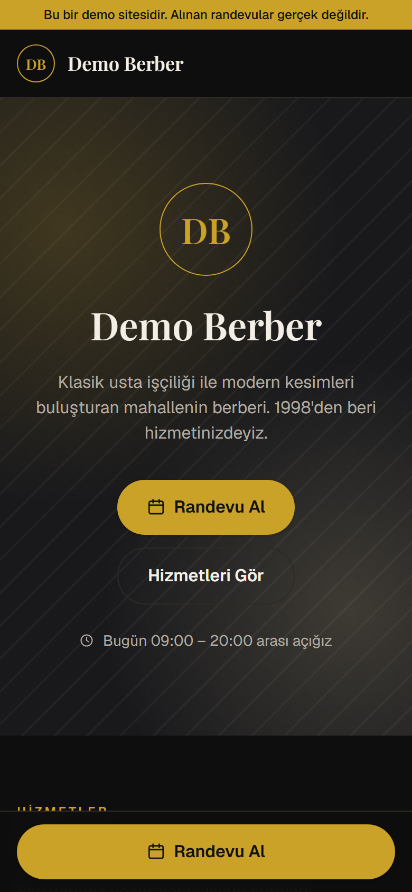
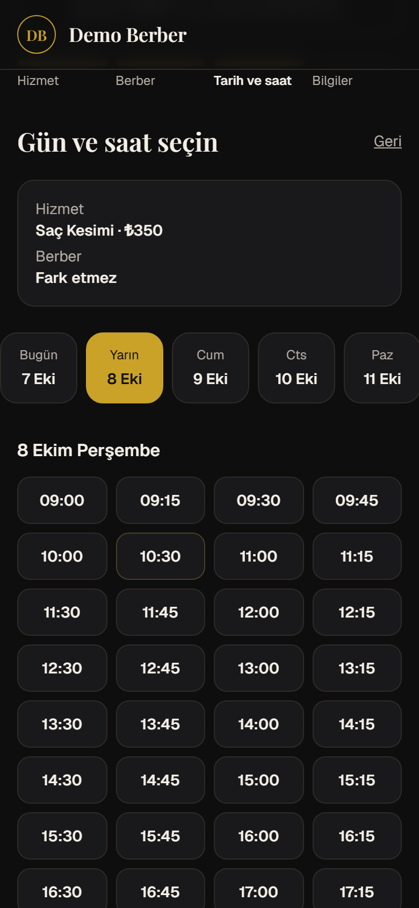
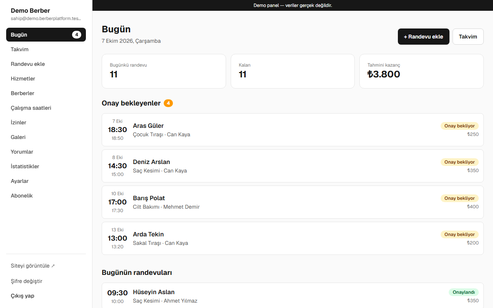

# BerberPlatform

Erkek berberleri için çok kiracılı (multi-tenant) online randevu platformu. Her dükkanın kendi
randevu sitesi ve yönetim paneli olur; platform sahibi tüm dükkanları tek bir süper yönetici
panelinden yönetir. Müşteri uygulama indirmez, üye olmaz: linkten 7/24 randevu alır.

Projenin tüm gereksinimleri [berber-randevu-platformu.md](berber-randevu-platformu.md) dosyasındadır.

<p>
  
  
</p>


## Özellikler

- **Dükkan sitesi:** hizmetler, fiyatlar, ekip, galeri, yorumlar, harita, çalışma saatleri; 4 hazır tema
- **Randevu alma:** hizmet → berber (veya "fark etmez") → gün/saat → bilgiler. Molalar, izinler,
  kapalı günler ve en erken/en geç randevu kuralları hesaba katılır; aynı saate iki randevu
  veritabanı kuralıyla engellenir
- **Müşteri randevu yönetimi:** tahmin edilemez linkle iptal ve saat değiştirme, takvime ekleme (.ics)
- **Dükkan paneli:** bugün, takvim, elle randevu, hizmetler, berberler, saatler, izinler, galeri,
  yorumlar, ayarlar, abonelik; sahip ve berber rolleri
- **İstatistikler:** randevu, gelmeyen, tahmini kazanç; berber/hizmet/gün/saat dağılımı
- **Süper yönetici:** dükkanlar, yeni dükkan sihirbazı, abonelik ve ödeme takibi, platform ayarları
- **Bildirimler:** e-posta (Resend) ve panelden hazır WhatsApp mesajları
- **Güvenlik:** her tabloda Supabase RLS, sunucu tarafı yetki kontrolleri, hız sınırları, honeypot,
  KVKK onayı ve 24 ay sonra otomatik anonimleştirme
- **SEO ve paylaşım:** dükkan adına göre başlık/açıklama, otomatik üretilen paylaşım görseli (Open Graph)

## Teknolojiler

Next.js 16 (App Router) · TypeScript · Tailwind CSS 4 · Supabase (Postgres, Auth, Storage, pg_cron) ·
Resend · Vitest · Vercel

## Yerel kurulum

1. Node.js 22 veya üstü gerekir.
2. Bağımlılıkları kurun:
   ```bash
   npm install
   ```
3. `.env.example` dosyasını `.env.local` adıyla kopyalayıp değerleri doldurun.
   `SUPABASE_SECRET_KEY` gizlidir; sadece `.env.local` içinde durur, git'e girmez.
4. Veritabanını hazırlayın (aşağıdaki "Veritabanı" bölümü), sonra geliştirme sunucusunu başlatın:
   ```bash
   npm run dev
   ```

## Adresler (yerel)

| Adres | Ne açılır |
|---|---|
| http://localhost:3000 | Platform tanıtım sayfası |
| http://demo.localhost:3000 | Demo dükkanın müşteri sitesi |
| http://demo.localhost:3000/panel | Demo dükkanın yönetim paneli |
| http://admin.localhost:3000 | Süper yönetici paneli |
| http://localhost:3000/?shop=demo | Demo dükkan, alt alan adı olmadan (seçim çerezde hatırlanır, `?shop=` ile çıkılır) |

Modern tarayıcılar `*.localhost` adreslerini ek ayar gerektirmeden bilgisayarınıza yönlendirir.

## Komutlar

| Komut | Açıklama |
|---|---|
| `npm run dev` | Geliştirme sunucusu |
| `npm run build` | Yayın derlemesi |
| `npm run start` | Derlenmiş uygulamayı çalıştırır |
| `npm run lint` | Kod kontrolü (ESLint) |
| `npm test` | Birim testleri (Vitest) |
| `npm run db:push` | Yeni migration'ları Supabase'e uygular |
| `npm run db:seed` | Demo dükkanı veritabanında sıfırlar (hesapları da bağlamak için `demo:reset`) |
| `npm run db:test` | Güvenlik (RLS) kontrollerini çalıştırır; tüm satırlarda `passed: true` olmalı |
| `npm run db:test:maintenance` | Günlük bakım işlerinin (gecikme, KVKK anonimleştirme) kontrolü |
| `npm run admin:create -- --email X` | Süper yönetici hesabı oluşturur |
| `npm run panel:user -- ...` | Dükkan paneline sahip/berber hesabı açar |
| `npm run demo:reset` | Demo dükkanı ve demo hesaplarını sıfırlar |
| `npm run db:advisors` | Supabase güvenlik/performans denetimi |
| `npm run db:types` | Veritabanından TypeScript tiplerini yeniden üretir |

## Veritabanı (Supabase CLI)

İlk kurulumda bir kez (proje klasöründeki terminalde):

```bash
npx supabase login
npx supabase link --project-ref <PROJE_REF>
npm run db:push
npm run db:seed
```

- Şema, güvenlik kuralları ve storage ayarları `supabase/migrations/` altındadır. Veritabanı
  değişiklikleri her zaman yeni bir migration dosyasıyla yapılır: `npx supabase migration new <ad>`.
- Yeni tablo eklerken `anon` / `authenticated` yetkileri (GRANT) ve RLS politikaları aynı
  migration'da açıkça yazılmalıdır; Supabase yeni tabloları otomatik olarak dışarı açmaz.
- Süper yönetici eklemek için: `npm run admin:create -- --email siz@ornek.com` (aşağıya bakın).

## ⚠️ KVKK aydınlatma metni hakkında

Dükkan sitelerindeki `/kvkk` sayfası (`app/sites/[slug]/(site)/kvkk/page.tsx`) bir **taslaktır**
ve hukuki danışmanlık yerine geçmez. Gerçek bir dükkan için yayına almadan önce mutlaka bir
hukukçuya (KVKK alanında uzman bir avukata) kontrol ettirin. Özellikle yurt dışına veri aktarımı
(barındırma ve e-posta servisleri) ve hukuki sebepler bölümleri gözden geçirilmelidir.

## Temalar

Dükkan temaları `lib/themes.ts` içindedir: `luxury`, `modern`, `classic`, `fresh`. Her dükkan bir
tema seçer ve isterse ana/vurgu rengini değiştirir. Renkler sayfaya CSS değişkeni olarak basılır,
Tailwind sınıfları (`bg-bg`, `text-text`, `bg-primary`, `text-on-primary` ...) bunları kullanır.
Hazır temaların okunabilirliği (kontrast) birim testleriyle kontrol edilir.

## Randevu alma (kısaca)

- Müsaitlik algoritması `lib/availability.ts` içinde saf fonksiyondur; testleri `lib/availability.test.ts`.
- Boş saatler `GET /randevu-al/saatler` uç noktasından gelir; randevu `randevu-al/actions.ts`
  Server Action'ıyla sunucuda oluşturulur (honeypot, IP hız sınırı, telefon kontrolü, saat yeniden doğrulama).
- Aynı saate iki randevu veritabanı kuralıyla engellenir; müşteri "Bu saat az önce doldu" mesajı görür.
- Spam limitleri `lib/constants.ts` içindeki `BOOKING_LIMITS` ile ayarlanır.
- Müşteri randevusunu `/randevu/{token}` sayfasından iptal eder veya saatini değiştirir
  (`lib/manage.ts`). İzin kuralı (`cancel_deadline_minutes`) `lib/manage-rules.ts` içinde saf
  fonksiyondur; hem sayfa hem sunucu aynı kuralı kullanır. Sayfa arama motorlarına kapalıdır.

## E-posta bildirimleri

- Sağlayıcı: [Resend](https://resend.com) (ücretsiz plan: ayda 3.000, günde 100 e-posta).
  Kod `lib/notifications/` altındadır; e-posta ve (şimdilik boş) SMS sağlayıcısı aynı arayüzü uygular.
- `.env.local` içinde `EMAIL_PROVIDER_API_KEY` tanımlı değilse e-posta gönderimi kapalıdır.
  `EMAIL_FROM` boşsa gönderen `onboarding@resend.dev` olur.
- **Alan adı doğrulanmadan** Resend sadece hesap sahibinin adresine ve test adreslerine
  (`delivered@resend.dev`) gönderir. Gerçek müşterilere gönderim için Resend'de alan adı
  doğrulanmalı ve `EMAIL_FROM` o alan adından bir adres olmalıdır (bkz. Bölüm 16, madde 6).
- E-postalar yanıt gönderildikten sonra (`after()`) gider; başarısız olursa randevu etkilenmez,
  hata sunucu loglarına yazılır. **Demo dükkanda hiçbir e-posta gönderilmez.**

## Dükkan paneli (`{slug}.PLATFORM_DOMAIN/panel`)

- Giriş: e-posta + şifre (Supabase Auth). Roller: **sahip** (her şey) ve **berber** (sadece kendi
  randevuları, kendi izinleri, kendi adına randevu ekleme). Yetki her sayfada ve her işlemde
  `lib/panel/auth.ts` ile kontrol edilir; son savunma hattı veritabanı RLS kurallarıdır.
- **Ücretsiz kurulumda hesaplar e-posta gönderilmeden açılır** (Supabase'in yerleşik e-postası saatte
  2 e-posta ve sadece proje ekibine gönderir):
  - Sahip hesabı: `npm run panel:user -- --slug demo --email sahip@ornek.com --role owner`
  - Berber hesabı: panelde **Berberler > Giriş hesabı aç** (geçici şifre ekranda bir kez gösterilir)
    veya `npm run panel:user -- --slug demo --email berber@ornek.com --role barber --barber "Berber Adı"`
  - Şifresini unutan berbere sahip **Yeni geçici şifre ver** ile yeni şifre verir; sahibe ise
    yukarıdaki komut (aynı e-postayla tekrar çalıştırmak şifreyi yeniler). Kullanıcılar şifrelerini
    panelde **Şifre değiştir** sayfasından değiştirir.
  - Alan adı alınıp Supabase'e özel SMTP tanımlanınca `.env.local`'de `AUTH_EMAILS_ENABLED=true`
    yapılır; "Şifremi unuttum" e-postayla çalışmaya başlar.
- `npm run db:seed` demo dükkanı yeniden oluşturduğu için panel üyelikleri de silinir; sonrasında
  `npm run demo:reset` kullanın; demo hesaplarını otomatik bağlar.

## Süper yönetici paneli (`admin.PLATFORM_DOMAIN`, yerelde http://admin.localhost:3000)

- İlk yönetici hesabınızı oluşturun (e-posta gönderilmez; şifre verilmezse geçici şifre ekrana yazılır):
  `npm run admin:create -- --email siz@ornek.com`
- Sayfalar: **Pano** (aktif dükkan, bu ay beklenen gelir, alınan ödemeler, gecikmiş ödemeler —
  7 günden fazla gecikene "Askıya alınmalı" işareti), **Dükkanlar**, **Yeni dükkan** sihirbazı
  (dükkan + sahip hesabı + abonelik + varsayılan saatler/hizmetler tek seferde), **Dükkan detayı**
  (abonelik, ödeme ekle → `paid_until` otomatik ilerler, askıya al / aktif et, üyelere geçici şifre),
  **Platform ayarları** (IBAN — kontrol hanesi doğrulanır; dükkan sahibinin Abonelik sayfasında görünür).
- Otomatik askıya alma yoktur; karar yöneticinindir (`SUSPEND_SUGGEST_AFTER_DAYS`, `lib/constants.ts`).

## Günlük otomatik işler (Supabase pg_cron, ücretsiz)

Her gün 03:00 (İstanbul) veritabanında `private.daily_maintenance()` çalışır:
- Ödenmiş süresi geçen abonelikleri "gecikti" yapar
- 24 aydan eski tamamlanmış/iptal randevulardaki müşteri iletişim bilgilerini anonimleştirir (KVKK)
- Eski hız sınırı kayıtlarını siler

Kontrol testi: `npm run db:test:maintenance` (geri alınan işlem içinde çalışır).
Not: Supabase ücretsiz projeleri bir hafta hiç kullanılmazsa duraklatılır; yayındaki günlük demo
sıfırlama görevi bunu önler (bkz. "Ücretsiz yayına alma").

## Demo dükkan

- `npm run demo:reset`: demo verisini bugüne göre baştan kurar, eski demo görsellerini siler ve
  `.env.local`'deki `DEMO_OWNER_EMAIL` / `DEMO_BARBER_EMAIL` hesaplarını bağlar (şifreler değişmez;
  hesap yoksa oluşturulup şifre ekrana yazılır). Aynı işlem yönetici panosundaki **Demo'yu sıfırla** butonundadır.
- Yayında her gece otomatik çalışır (`/api/cron/demo-reset`, `CRON_SECRET` ile korunur).
- `DEMO_OWNER_PASSWORD` / `DEMO_BARBER_PASSWORD` tanımlıysa demo panel giriş sayfasında
  **Dükkan sahibi olarak dene** / **Berber olarak dene** butonları çıkar; şifreler sayfada gösterilmez.
- Demo dükkanda ziyaretçiler giriş hesaplarını ve şifreleri değiştiremez; diğer değişiklikler gece silinir.

## İstatistikler

- Panel > İstatistikler: bugün / bu hafta / bu ay / geçen ay / özel aralık. Hesaplar sunucuda, saf
  fonksiyon olarak `lib/stats.ts` içinde; elle kontrol edilebilir test senaryosu `lib/stats.test.ts`.
- Berber sadece kendi randevularının istatistiğini görür (veritabanı kuralı).

## Nasıl çalışır? (kısaca)

`proxy.ts` her istekte host'a bakar ve isteği dahili klasörlere yönlendirir:

- `{slug}.PLATFORM_DOMAIN/...` → `app/sites/[slug]/...`
- `admin.PLATFORM_DOMAIN/...` → `app/admin/...`
- Ana alan adı → `app/(platform)/...`

`/sites` ve `/admin` yollarına dışarıdan doğrudan erişim engellidir. Tek adres modunda
(`NEXT_PUBLIC_SINGLE_DOMAIN_MODE=true`) dükkan `?shop=slug` ile seçilir ve süper yönetici paneli
`/admin` yolundan açılır; linkler `lib/links.ts` içindeki yardımcılarla iki moda göre üretilir.

## SEO ve erişilebilirlik

- Dükkan sayfaları dükkan adıyla başlık/açıklama ve paylaşım görseli alır (`/api/og/{slug}`, sunucuda
  `next/og` ile çizilir). Paneller ve kişiye özel randevu sayfaları arama motorlarına kapalıdır (`app/robots.ts`).
- Görseller `next/image` ile optimize edilir; panelden yüklenen görseller tarayıcıda küçültülüp WebP
  olarak yüklenir (en fazla 5 MB).
- Formlarda etiketler, klavyeyle kullanım ve odak göstergeleri vardır; sayfalar axe-core ile
  (WCAG 2.1 AA) taranmıştır.

## Ücretsiz yayına alma (Vercel + Supabase, alan adı olmadan)

Bu kurulumun **hiçbir ücreti yoktur**: Vercel Hobby, Supabase Free ve Resend ücretsiz planları
kullanılır. Alan adı alınmadığı için site `proje-adi.vercel.app` adresinde çalışır.
`*.vercel.app` adreslerinde alt alan adı (`demo.proje-adi.vercel.app`) açılamadığı için
**tek adres modu** kullanılır:

| Adres | Ne açılır |
|---|---|
| `https://proje-adi.vercel.app` | Platform tanıtım sayfası |
| `https://proje-adi.vercel.app/?shop=demo` | Demo dükkan sitesi (seçim çerezde hatırlanır) |
| `https://proje-adi.vercel.app/panel/giris?shop=demo` | Demo dükkan paneli |
| `https://proje-adi.vercel.app/admin` | Süper yönetici paneli |

1. **GitHub:** github.com'da yeni bir depo açın (portföy için "Public" olabilir; `.env.local` git'e
   girmez). Proje klasöründe:
   ```bash
   git remote add origin https://github.com/KULLANICI/DEPO.git
   git push -u origin main
   ```
2. **Vercel:** vercel.com'a GitHub hesabınızla girin (Hobby planı, ücretsiz) → *Add New → Project* →
   depoyu seçin. *Environment Variables* bölümüne şunları girin (değerler `.env.local` ile aynı):

   | Değişken | Değer |
   |---|---|
   | `NEXT_PUBLIC_SUPABASE_URL`, `NEXT_PUBLIC_SUPABASE_PUBLISHABLE_KEY`, `SUPABASE_SECRET_KEY` | Supabase anahtarları |
   | `NEXT_PUBLIC_PLATFORM_DOMAIN` | `proje-adi.vercel.app` (Vercel'in verdiği adres) |
   | `NEXT_PUBLIC_SINGLE_DOMAIN_MODE` | `true` |
   | `NEXT_PUBLIC_PLATFORM_NAME` | `BerberPlatform` |
   | `AUTH_EMAILS_ENABLED` | `false` |
   | `CRON_SECRET` | rastgele uzun bir değer (günlük demo sıfırlamayı korur) |
   | `DEMO_OWNER_EMAIL`, `DEMO_BARBER_EMAIL`, `DEMO_BARBER_NAME`, `DEMO_OWNER_PASSWORD`, `DEMO_BARBER_PASSWORD` | demo hesapları ("… olarak dene" butonları için) |
   | `EMAIL_PROVIDER_API_KEY`, `EMAIL_FROM` | isteğe bağlı (Resend) |
   | `NEXT_PUBLIC_PLATFORM_SUPPORT_WHATSAPP` | isteğe bağlı; tanıtım sayfasındaki WhatsApp butonu |

   Vercel adresi ilk yayından sonra belli oluyorsa `NEXT_PUBLIC_PLATFORM_DOMAIN`'i girip
   *Redeploy* yapın (`NEXT_PUBLIC_` değerleri derleme sırasında koda yazılır).
3. **Supabase:** *Authentication → URL Configuration → Site URL* alanına `https://proje-adi.vercel.app`
   yazın. *Authentication → Sign In / Providers* bölümünde herkese açık kaydı
   (*Allow new users to sign up*) kapalı tutun.
4. **Günlük görev:** `vercel.json` içindeki cron her gün 01:00 UTC'de (04:00 İstanbul)
   `/api/cron/demo-reset` adresini çağırır: demo dükkan sıfırlanır, örnek randevular bugüne göre
   yeniden kurulur. Bu düzenli kullanım, Supabase ücretsiz projesinin "1 hafta kullanılmadı"
   gerekçesiyle duraklatılmasını da önler.
5. **Yönetici hesabı:** kendi bilgisayarınızda `npm run admin:create -- --email siz@ornek.com`,
   sonra `https://proje-adi.vercel.app/admin` adresinden giriş yapın.

### Ücretsiz planların sınırları

- **Vercel Hobby** sadece ticari olmayan (kişisel/portföy) kullanım içindir. Gerçek, ücretli
  müşterilerle kullanılacaksa Vercel Pro (kullanıcı başına aylık 20 $) gerekir.
- **Supabase Free:** 500 MB veritabanı, 1 GB dosya alanı; 1 hafta hiç istek gelmezse proje duraklar
  (yukarıdaki günlük görev bunu önler). "Sızdırılmış şifre koruması" sadece ücretli planda vardır.
- **Resend Free:** günde 100, ayda 3.000 e-posta; alan adı doğrulanmadan sadece hesap sahibinin
  adresine gönderir.

### İleride alan adıyla yayın

Alan adı alınınca (yıllık ücretlidir): alan adının nameserver'larını Vercel'e yönlendirin, Vercel'de
ana alan adını ve `*.alanadi.com`'u projeye ekleyin, `NEXT_PUBLIC_PLATFORM_DOMAIN=alanadi.com` ve
`NEXT_PUBLIC_SINGLE_DOMAIN_MODE=false` yapın. Dükkanlar `demo.alanadi.com`, yönetici paneli
`admin.alanadi.com` adresinden açılır. E-posta için Resend'de alan adını doğrulayın (SPF/DKIM).

